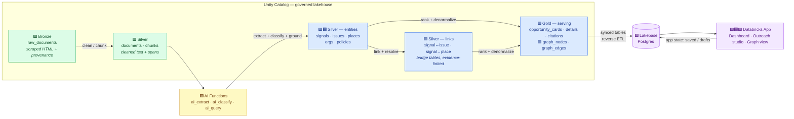
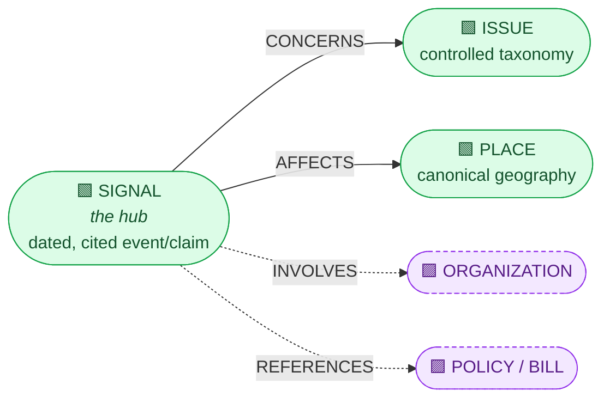
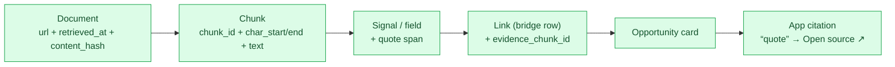
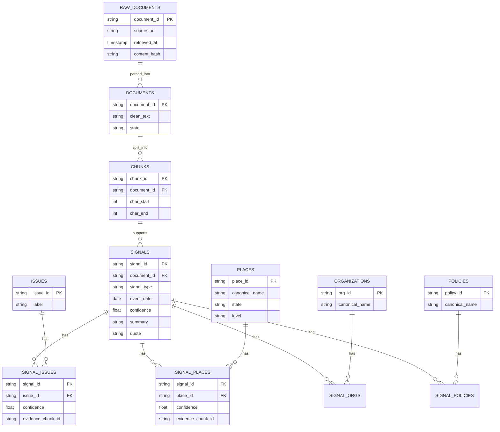
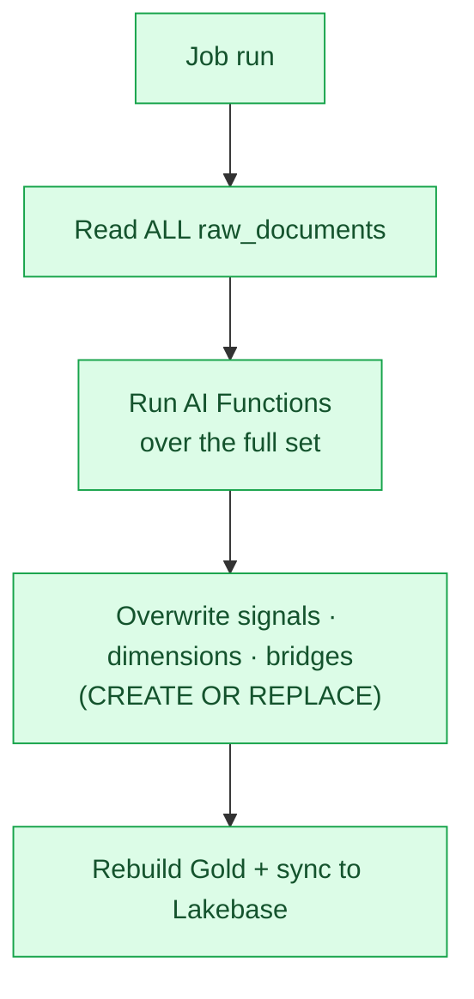
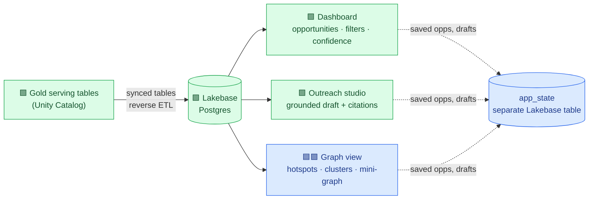

# GO Project — Solution Design (v0.1)

> High-level architecture for turning scraped public web content into **evidence-backed
> outreach opportunities** for the GO Project outreach team, plus an experimental
> **knowledge graph** for meta-analysis.
>
> This is a *first draft* built on reasonable assumptions. It focuses on the **data
> pipeline**, assuming scraped web documents are **already available in Unity Catalog**.
> Everything is batch, governed, and Databricks-native.

## Requirement scope

We tag every component with the requirement tier it serves so we can cut scope safely.

| Tag | Tier | Requirement |
|-----|------|-------------|
| **`M`** | Must | Web scraping (assumed done); outreach **dashboard** with region-specific issues; **citations** for all GenAI output |
| **`S`** | Should | A **basic knowledge graph** to visualize & analyze the scraped data |
| **`C`** | Could | **Robust NER** (location, issue, policy, organization…); an **interactive** graph interface (GUI/chat/something new) |
| ~~`W`~~ | Won't | Production scale — CI/CD hardening, robust/scaled scraping |

Legend used in diagrams: 🟩 must · 🟦 should · 🟪 could.

---

## 1. High-level architecture

Batch-first medallion pipeline. A **typed relational Delta model is the system of
record**; two derived products are projected from it — flat **serving views** for the
dashboard and a lightweight **node/edge projection** for the graph view. Gold syncs to
**Lakebase** (managed Postgres) so the Databricks App reads with low latency.

**Orchestration:** a single Lakeflow **Job** (the bundle already scaffolds one) chains the
stages as tasks on serverless. For the hackathon it **reprocesses the full dataset every
run** (simple + safe to re-run); an incremental path is designed for later (§6).

---

## 2. Entity model (ontology)

**Principle:** keep the ontology tiny and *source-independent*. A newspaper article, a
bill, a grant notice, and a county report all reduce to the same shape: **something
happened (a Signal) that concerns an Issue and affects a Place.** That single sentence is
the whole must/should model.

We use **one hub type + a small controlled set of entity types**:

| Type | Tier | What it is | How it's produced |
|------|------|-----------|-------------------|
| **Signal** | `M` | An atomic "something is happening" claim, with a **type** (policy event, funding, report/indicator change, program, emergency, service gap), date(s), summary, affected populations. This is the outreach unit. | `ai_extract` + `ai_classify` |
| **Issue** | `M` | Small GO-relevant **controlled taxonomy** — e.g. *housing stability, family preservation, food & material needs, youth mental health, education access, emergency response*. | `ai_classify` (fixed label set) |
| **Place** | `M` | Geography (state → county → city/district), canonicalized. Drives the NY / CA / VA territory filter. | `ai_extract` + deterministic gazetteer resolution |
| **Organization** | `C` | Agencies, councils, sponsors, nonprofits named in the source. Enables richer NER and outreach targeting. | `ai_extract` NER + alias resolution |
| **Policy / Bill** | `C` | Named legislation / policy referenced (natural fit for legislative sources). | `ai_extract` NER |

**Why this set?** `Signal / Issue / Place` is the minimum that satisfies Must (region-specific
issues) and Should (a graph worth visualizing). `Organization` and `Policy` are the
`Could`-have "robust NER" types — they light up the graph and outreach when data supports
them, but nothing breaks if we skip them. Documents/chunks/citations stay in the
**provenance model** (§5); they are *not* graph-navigation types.

---

## 3. How we extract — AI Functions

> 🚧 **Status: initial — to be evolved.** The specific function mix and prompts below are a
> starting point, not a committed design. See the *"to be decided"* note at the end of this
> section.

All extraction runs as **SQL batch AI Functions** over the source text. Deterministic parsing
stays primary where it's reliable; AI handles the fuzzy semantic work.

| Step | Function | Output | Robustness lever |
|------|----------|--------|------------------|
| Field extraction | **`ai_extract`** | Signal title, summary, dates, populations, mentioned places/orgs/policies, **supporting quote span** | Schema-constrained (JSON schema) so fields can't drift |
| Classification | **`ai_classify`** | Issue label + signal type + confidence | **Fixed label set** → stable, joinable, cheap |
| Grounded relations & relevance | **`ai_query`** | "Does this signal really concern issue X? Quote the exact sentence." + GO-relevance score + "why GO" line | Constrained output; **must cite a chunk or it's dropped** |
| Outreach draft `M` | **`ai_query`** | Draft message grounded **only** on selected citations + approved GO facts | Human approval required before use |

### What robust entity extraction also needs (beyond calling the functions)

1. **Controlled vocabularies** for Issue and Signal-type, and a **gazetteer** (state/county/
   city, e.g. FIPS) for Place → labels are consistent and joinable, not free text.
2. **Entity resolution / canonicalization** — collapse *"San Diego" / "San Diego County" /
   "City of San Diego"* into one `place_id`; fuzzy-match org names against an alias table.
   This *is* the `Could`-have "robust NER."
3. **Confidence scores + thresholds** — surface high/medium, hide/flag low. (The dashboard
   must show a confidence score, so we carry it through as a first-class column.)
4. **Grounding & verification** — every extracted field and every relationship references
   the chunk that supports it; a lightweight `ai_query` verification pass drops claims whose
   quote doesn't actually support them. *No unsupported generated fact is surfaced.*
5. **Repeatable output** (§6) — for the hackathon we re-run extraction over the full dataset
   each time; deterministic keys keep a later incremental/cached path a drop-in change.

> ⚖️ **To be decided — one function or three?** The table above splits work across
> `ai_extract` / `ai_classify` / `ai_query` for clarity and cheaper constrained steps. But a
> single **`ai_query`** call with a rich JSON schema could do extraction *and* classification
> *and* grounding in one pass — fewer round-trips, one prompt to maintain, at the cost of less
> control and higher per-call token use. We'll decide empirically (accuracy vs. cost vs.
> simplicity) once we see real documents; the data model in §5 is agnostic to which we pick.

---

## 4. Citations & source lineage `M`

> 🚧 **Status: initial — to be evolved.** The span/offset mechanics here depend on the
> chunking decision in §5.

**Sources must flow end-to-end** — every surfaced fact traces back to an exact span on a
live page.

- A **citation** = `{ document_url, chunk_id, char_start, char_end, quote }`. Carried on
  every AI-produced row (signal fields *and* relationship edges).
- **Deep-link back to the page:** since all sources are scraped **webpages**, we build the
  citation link as a **[URL Text Fragment](https://developer.mozilla.org/docs/Web/URI/Fragment/Text_fragments)**:
  `https://source.example/page#:~:text=<url-encoded quote>`. Modern browsers **scroll to and
  highlight** that exact sentence on the original page — no annotation service needed. If the
  fragment ever misses, we fall back to the plain URL.
- **Provenance is append-only** and lives in the relational core; the app renders it but
  never lets a fact appear without a chunk-level citation.

---

## 5. Delta data model

> 🚧 **Status: initial — to be evolved.** The medallion layering is stable; the **chunking
> layer** and the **core-model shape** are both explicitly open (see below).

### ⚖️ To be decided — chunking strategy

How we slice source documents drives extraction quality *and* citation mechanics. The right
answer depends on **source-document size** and whether a full page fits in one extraction
call. Two ends of the spectrum:

| Option | How it works | Good when | Trade-off |
|--------|-------------|-----------|-----------|
| **A. Semantic chunking, extract per chunk** | Split into semantically coherent chunks so each chunk *contains the entities to extract*; run AI Functions per chunk | Long pages; cheaper per-call; each result maps to a tight span | Risk of **splitting an entity/relationship across a boundary**; needs good chunker |
| **B. Extract from the full document** | Run extraction over the whole page; create child chunks **only for source/citation anchoring** | Short/medium pages that fit the context window; keeps cross-sentence relationships intact | Larger, costlier calls; must map results back to spans |

Note that under **Option B**, the citation span (and Text-Fragment highlight, §4) can be
resolved **on the fly** from the full document at serve time — we don't strictly need
persisted child chunks, just enough offset/quote metadata to re-locate the text. **Decision
deferred** until we see real document sizes; the `chunks` table below is drawn for Option A
and would simplify (or become a lightweight citation-anchor table) under Option B.

---

### ⚖️ To be discussed — core-model shape

The bigger question is what the **core system of record** looks like. Two philosophies:

| Option | Core guiding principle | Pros | Cons |
|--------|------------------------|------|------|
| **A. Standard relational (star + bridges)** ← *proposed* | A `signals` **fact** + dimension tables (`issues`, `places`, `organizations`, `policies`) joined by explicit **bridge tables** (`signal_issues`, `signal_places`, …), each bridge row carrying confidence + evidence | Matches the app's Must-have query shape directly; simplest joins; cleanest to sync to Lakebase; graph is easy to derive | The graph is a *second* artifact you build, not free |
| **B. Graph-first (nodes + one generic edge table)** | Everything is a node; a single polymorphic `relationships(src_type, src_id, predicate, dst_type, dst_id, …)` edge table is the guiding principle; flat views derived for the app | Graph view is native; uniform way to add new relationship types | Polymorphic edges are awkward and slow to query for the dashboard; app serving needs derived flat views anyway |

**Proposal (to be discussed): go with Option A.** The Must-have is the outreach dashboard,
and its natural shape is *"signals filtered by issue / place / time / confidence"* — a star
schema serves that with plain, fast joins and syncs cleanly to Lakebase. The knowledge graph
(`Should`) is then **derived** from the same tables: nodes = the dimension members + signals;
edges = the bridge rows, plus **co-occurrence edges** (e.g. *issue ↔ place*) computed by a
self-join on signals that share both. So we get one clean serving model *and* a graph, without
a generic edge table complicating every dashboard query. Revisit if relationships become
highly heterogeneous, in which case Option B's uniformity starts to pay off.

The ER diagram below reflects the **proposed Option A**.

*(`SIGNAL_ORGS` and `SIGNAL_POLICIES` follow the same bridge pattern — `Could`-have 🟪.)*

**Layering (medallion):**

| Layer | Tables | Notes |
|-------|--------|-------|
| **Bronze** `M` | `raw_documents` | Scraped HTML + `source_url`, `retrieved_at`, **`content_hash`** (append-only) |
| **Silver** `M` | `documents`, `chunks` | Cleaned text + span offsets for citations (chunking TBD, above) |
| **Silver** `M`/`S` | `signals`, `issues`, `places`, `organizations`🟪, `policies`🟪 | Canonicalized fact + dimensions |
| **Silver** `S` | `signal_issues`, `signal_places`, `signal_orgs`🟪, `signal_policies`🟪 | Bridge tables — confidence + evidence per link |
| **Gold** `M` | `opportunity_cards`, `opportunity_details`, `opportunity_citations` | Denormalized for the app; **transparent ranking** score |
| **Gold** `S` | `graph_nodes`, `graph_edges` | **Derived** projection for the graph view (incl. co-occurrence edges) — *never the system of record* |

**Ranking** (Gold, pure SQL): `priority = f(child_impact, timing/urgency, locality,
evidence_confidence)` with every component visible in the UI.

---

## 6. Processing model — full reprocess first `M`

> ⚖️ **To be discussed.** Proposed starting point below; the incremental alternative is the
> evolution path (also below).

**Proposed for the hackathon: reprocess the full dataset on every job run.** Each stage
rebuilds its tables from scratch (`CREATE OR REPLACE` / overwrite). This is the simplest thing that works:
no state to track, no watermark to get wrong, trivially "idempotent" because a re-run just
reproduces the same output. It's fine at hackathon data volumes, and we accept that we
re-pay AI Function cost each run.

**But build so we can evolve** — a few cheap habits now keep the door open to incremental
processing later without a rewrite:

- Keep a **`content_hash`** on `raw_documents` — but see the caveat below: for scraped pages it
  must be a hash of *normalized main-text*, not raw HTML, to be a usable change-detection key.
- Use **deterministic natural keys** (e.g. `signal_id = hash(document_id, signal_type, span)`)
  even while overwriting, so a later switch to `MERGE` upserts is a drop-in change.
- Keep each stage a **pure function of its input** (no hidden accumulation), so full-rebuild
  and incremental produce the same result.

### Evolution path (post-hackathon) 🟪

> ⚠️ **Change detection on scraped pages is genuinely hard — don't underestimate it.**
> Hashing **raw HTML** is nearly useless: timestamps ("updated 3 min ago"), ad slots, view
> counters, CSRF/session tokens, rotating banners, and non-deterministic attribute/whitespace
> ordering mean two scrapes of an *unchanged* page rarely produce the same hash → everything
> looks "changed" and you reprocess the full set anyway (no savings). Too-lax detection is
> worse: you miss real updates and serve **stale** opportunities. And the thing that actually
> costs money — **AI inference** — is exactly the thing hardest to skip reliably. Treat
> incremental as real work, not a config flag; this is *why* full reprocess is the hackathon default.

Approaches, roughly in order of robustness/effort:

- **Hash normalized main-text, not raw HTML** — run boilerplate/main-content extraction
  (readability/trafilatura-style), strip known volatile regions, normalize whitespace, *then*
  hash. Much more stable, still imperfect (an "Updated: …" line, minor edits).
- **Signal-level fingerprinting** — deterministic key from each signal's *normalized claim*
  (not the page), then `MERGE`. The signal set converges even if the HTML jittered — but this
  dedupes **storage**, not inference cost (you already ran the AI call).
- **Fuzzy "materially changed?"** — simhash/minhash or embedding similarity with a threshold.
  Most robust, most moving parts; becomes a tuning problem.
- **Processed watermark** keyed on `(document_id, <stable-fingerprint>, pipeline_version)` +
  **`MERGE` upserts** on deterministic keys; bump `pipeline_version` to force a re-extract when
  prompts/schema change.
- Optionally **Delta Change Data Feed** / **Lakeflow Declarative Pipelines** (`APPLY CHANGES`)
  once a *stable* fingerprint exists — they help propagate changes, but don't solve the "what
  counts as changed?" problem for you.

---

## 7. Serving — Gold → Lakebase → App

- **Read path:** Gold tables sync into Lakebase via **synced tables** (reverse ETL) so the
  Databricks App gets low-latency Postgres reads.
- **Write path:** app-generated state (saved opportunities, outreach drafts) goes to a
  **separate Lakebase table**, *not* the synced ones (synced tables are read-only replicas).
- The **App** (single Databricks App) hosts all three surfaces: Dashboard, Outreach studio,
  Graph view — inspired by the prototype's unified workspace.
- **Note (to explore):** we might build the web app with **[AppKit](https://developers.databricks.com/docs/appkit/v0)**
  rather than a hand-rolled framework — could accelerate the UI for the hackathon. TBD.

---

## 8. Graph visualization — meaningful, not a hairball `S`/`C`

> ⚖️ **To be discussed.** These are proposed presentation ideas, not a committed UX. See the
> data-dependency note at the end — it changes what we actually need to build.

**Problem with the prototype:** both a raw node/edge browser *and* the step-by-step "explore
connections" path-walker force the user to think in graph topology. Outreach users don't want
to traverse a graph — they want to know **where the pressure is** and **why an opportunity
matters**. So we do the **graph reasoning in the backend and present human-legible patterns**,
not nodes to click through.

Three layered views, simplest first:

1. **Issue × Place hotspot matrix `S`** — *the primary meta-analysis view.* A grid: rows =
   issues, columns = states/counties; each cell shows **signal density + recent trend** (and
   optionally cross-source corroboration count). This is the graph collapsed into a view a
   human reads in two seconds: "housing is heating up in San Diego." Click a cell → the
   underlying signals. Answers the "analyze the scraped data" requirement directly.

2. **Corroboration clusters `S`** — group signals that share the same *(issue, place)* across
   **multiple independent sources** into one **narrative card**: *"3 independent sources point
   to a housing crunch in San Diego."* This is graph community detection rendered as prose +
   a tiny supporting sub-graph. Meaningful because corroboration = confidence.

3. **Explained mini-graph per opportunity `M`** — on each opportunity, a *small* (3–5 node)
   `Signal → concerns → Issue → affects → Place` graph with **plain-language edge labels and a
   one-sentence explanation** + citations. This is the "why GO should care" panel, and it's
   the only place raw nodes/edges appear — always tiny, always explained.

4. **Interactive / chat interface `C`** — a natural-language question over the graph
   ("show rising youth-mental-health signals in Virginia") powered by Genie / `ai_query` on
   Gold. Marked `Could` — build only if the core lands.

> Design rule: **graph structure lives in Delta; the UI shows patterns and explained
> sub-graphs, never a free-floating network to untangle.**

### Do these views even need a materialized graph? (mostly no)

An important consequence of the approach above: **none of the three `M`/`S` views require a
persisted `graph_nodes`/`graph_edges` projection.** They all come straight from the star
schema (§5):

| View | What it actually needs | Materialized graph? |
|------|------------------------|---------------------|
| Hotspot matrix | `GROUP BY issue_id, place_id` over the bridges → count + trend | No — SQL aggregate |
| Corroboration clusters | Signals grouped by `(issue, place)`, `COUNT(DISTINCT document_id)` for source diversity | No — a `GROUP BY` (co-occurrence = self-join, not traversal) |
| Explained mini-graph | One signal + its directly linked issue/place/org (its bridge rows) | No — a **1-hop lookup**; drawn as a graph, but the data is a single-signal query |

A materialized node/edge projection only earns its keep for the **`Could`-have** explorer:

- **Multi-hop traversal** — arbitrary-depth paths (the old "explore connections" walker).
- **Graph algorithms** — centrality/PageRank, community detection beyond simple co-occurrence,
  shortest path.
- A **generic `{nodes, edges}` feed** for an interactive force-directed view — and even then it
  can be generated on the fly from the star, materialized only if performance demands.

**Proposal:** drop `graph_nodes`/`graph_edges` from the Must/Should Gold layer; serve §8 from
the star schema, and add a node/edge projection (likely just a **view**) *only if* we build the
interactive explorer. Fewer tables to sync to Lakebase. *(Would update §5's layering table
accordingly.)*

---

## 9. Open assumptions & decisions to confirm

**Sections 3, 4, and 5 are marked _initial / to be evolved_.** Key open decisions:

- ⚖️ **Chunking strategy** (§5) — semantic-chunk-and-extract vs. extract-from-full-document
  with on-the-fly citation anchoring. Depends on source-document size. *Deferred.*
- ⚖️ **Core-model shape** (§5) — standard relational (star + bridge tables, *proposed*) with the
  graph **derived**, vs. a graph-first generic edge table. *To be discussed.*
- ⚖️ **AI Function mix** (§3) — split across `ai_extract`/`ai_classify`/`ai_query` vs. a single
  `ai_query` with a rich schema. Decide on accuracy/cost/simplicity with real data. *Deferred.*
- ⚖️ **Processing model** (§6) — full reprocess every run (*proposed for the hackathon*) vs.
  incremental (content-hash + `MERGE`). *To be discussed.*
- ⚖️ **Graph presentation & materialization** (§8) — proposed views (hotspot matrix,
  corroboration clusters, explained mini-graph) served from the star schema; a materialized
  `graph_nodes`/`graph_edges` projection only if we build the `Could`-have explorer. *To be discussed.*

Other assumptions:

- Scraped webpages are already in UC (Bronze) with at least `source_url` + retrieval time; we
  add `content_hash` if not present.
- Issue taxonomy (§2) is a first cut — to be validated with GO's actual outreach categories.
- `Organization` / `Policy` entities are `Could`-have; core demo works with `Signal/Issue/Place`.
- Territory scope fixed to **NY / CA / VA** per Appendix A.
- Text Fragment deep-links depend on the source page being publicly reachable at citation time.
